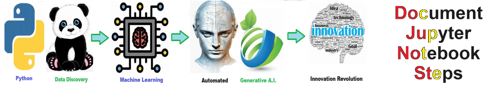

# Jupyter Notebook Process Steps - Routine for extracting the major steps or workflow from any notebook.

## Description

Welcome to the solution Jupyter Notebook Process Steps - an example for your projects

Routine for extracting the major steps or workflow from any notebook.
    
## Features
- Easy to understand and use  
- Easily Configurable 
- Quickly start your project with pre-built templates
- Its Fast and Automated
    
## Notebook Features
- Self Documenting 
- Self Testing 
- Easily Configurable
- Includes Talking Code - The code explains itself
- Self Logging 
- Self Debugging 
- Low Code - or - No Code
- Educational 
    

    